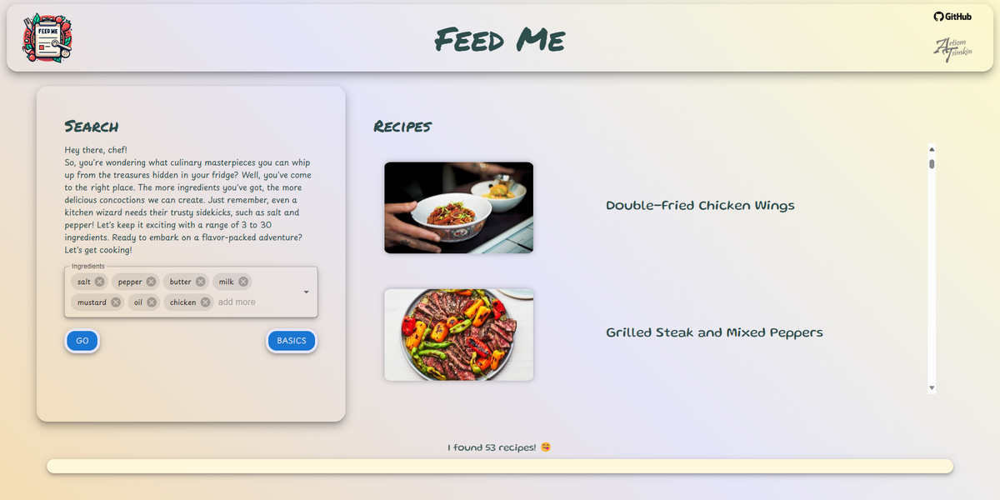

<h1 align="center">Feed Me</h1>

### Deployment

Available at: [feed-me.onrender.com](https://feed-me.onrender.com/)

### Overview

A modern and responsive web app, built on React-Django-Redis, that enhances your culinary experience. Discover exciting recipes based on the ingredients in your fridge, with a unique matching threshold feature. With over 12,000 recipes, 1,000 ingredients, and helpful suggestions for base ingredients, the app provides images, comprehensive ingredient lists, and detailed cooking instructions.

## Front-end

### Stack

- React
- Material UI
- Framer Motion

## Back-end

### Stack

- Django
- GraphQL

## Database

### Stack

- Redis
- SQLite

## References

- Recipes dataset: [Kaggle](https://www.kaggle.com/datasets/pes12017000148/food-ingredients-and-recipe-dataset-with-images/)
- Ingredients dataset: [Kaggle](https://www.kaggle.com/datasets/kaggle/recipe-ingredients-dataset)

## Screenshots

