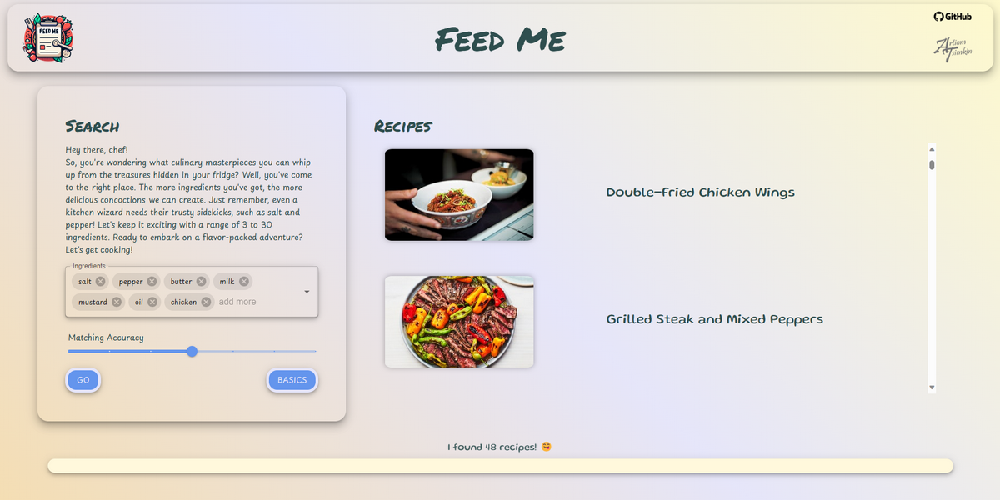
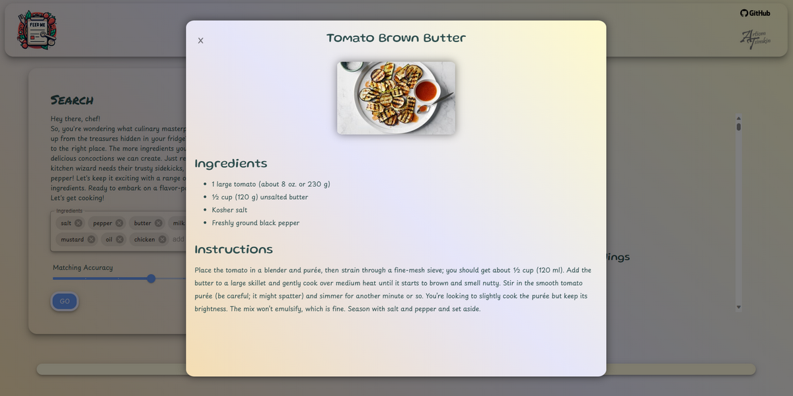

<h1 align="center">Feed Me</h1>

### Deployment

Available at: [feed-me.onrender.com](https://feed-me.onrender.com/)

### Overview

A modern fun and responsive web app that is based on React-Django-Redis. it can offer you culinary ideas based on what ingredients are available in your fridge. While featuring over 12,000 recipes with over 1,000 ingredients, and suggesting base ingredients, the app will showcase images, complete lists of ingredients, and detailed cooking instructions.

## Front-end

### Stack

- React
- Material UI
- Framer Motion

## Back-end

### Stack

- Django
- GraphQL

## Database

### Stack

- Redis
- SQLite

## References

- Recipes dataset: [Kaggle](https://www.kaggle.com/datasets/pes12017000148/food-ingredients-and-recipe-dataset-with-images/)
- Ingredients dataset: [Kaggle](https://www.kaggle.com/datasets/kaggle/recipe-ingredients-dataset)

## Screenshots

